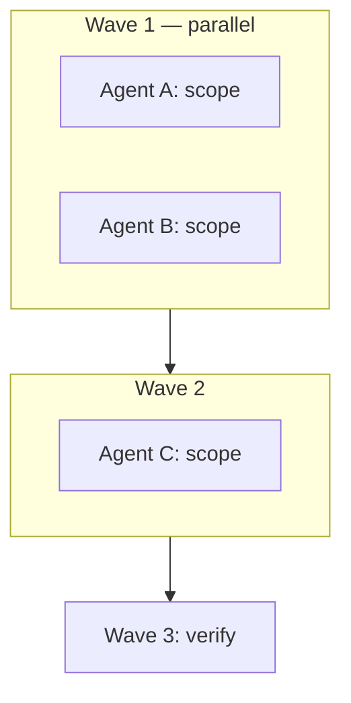

# Multitask Implementation Plan

Standard format for implementation plans that support wave-based parallel subagent execution.

## When to use

- User wants a plan before implementation
- Task spans 3+ disjoint file areas or needs parallel subagents
- User mentions multitask, waves, parallelism, goals / no-goals, or `/create-plan`

## Pre-plan discovery

Before calling `CreatePlan` or writing a plan file:

1. Read relevant existing code and docs (focused paths only)
2. Confirm approach vs alternatives (short **Validation** section)
3. List explicit **Goals** and **No-goals** (preserve user constraints verbatim when provided)
4. Map **file changes**: create | update | delete per path
5. Identify **wave dependencies** (what blocks what)

## Required plan sections (order)

| # | Section | Purpose |
|---|---------|---------|
| 1 | YAML frontmatter | `name`, `overview`, `todos` (wave IDs), `isProject` |
| 2 | **Goals** | What success looks like (bullet list) |
| 3 | **No-goals** | Explicit out-of-scope / rejected approaches |
| 4 | **Validation** | Why chosen approach; option comparison table if needed |
| 5 | **Target flow** | Numbered steps or ASCII; optional mermaid sequence |
| 6 | **Rejected** | Alternatives considered and why not |
| 7 | **File change matrix** | Path + action (C/U/D) + one-line intent |
| 8 | **Wave 0 — Contracts** | Shared rules table for all subagents |
| 9 | **Execution — waves** | Mermaid flowchart; per-wave agent table |
| 10 | **Implementation detail** | Per-agent scope: files, snippets, constraints |
| 11 | **Manual verification** | Numbered checklist |
| 12 | **Out of scope** | Repeat critical no-goals |

Use [plan-template.md](plan-template.md) as the empty skeleton.

## YAML frontmatter

```yaml
---
name: Short plan title
overview: One-sentence summary of approach and execution model (waves / parallelism).
todos:
  - id: wave0-contracts
    content: "Wave 0 (parent): Pin shared contracts for all agents"
    status: pending
  - id: wave1-agent-a
    content: "Wave 1 parallel — Agent A: <scope>"
    status: pending
  - id: wave3-verify
    content: "Wave 3: jest, tsc-verify, manual checklist, review"
    status: pending
isProject: false
---
```

### Todo ID convention

- Prefix by wave: `wave0-contracts`, `wave1-agent-a-*`, `wave2-*`, `wave3-verify`
- One todo per parallel agent + coordinator + verification
- `overview` summarizes approach in one sentence

## Multitask / parallelism rules

| Rule | Detail |
|------|--------|
| Wave 0 | Parent only — contracts table, no code |
| Parallel launch | Dispatch Wave N with multiple `Task` tools in **one message**; use `run_in_background: true` when user enables multitask |
| Disjoint ownership | No two agents edit the same file in the same wave |
| Subagent types | `cavecrew-builder` (1–2 files), `generalPurpose` (multi-file feature), `shell` (tests in wave 3) |
| Sequencing | Wave N+1 starts only after blocking agents complete |
| Failures | Re-dispatch **failed agent only**; do not restart completed work |
| Parent role | Synthesize blockers only; avoid re-summarizing each subagent unless asked |

## Subagent prompt template

Each `Task` prompt must include:

```markdown
## Goal
<one sentence>

## Allowed files
- path/to/file-a.ts
- path/to/file-b.ts

## Forbidden
- Other agents' files (list paths)
- No-goals: <from plan>

## Contracts (Wave 0)
| Rule | Detail |
|------|--------|
| ... | ... |

## Return format
1. Files changed (with brief intent)
2. Tests run and results
3. Blockers for parent or next wave
```

## File change matrix

```markdown
| Path | Action | Intent |
|------|--------|--------|
| `src/foo/bar.ts` | Update | Add 401 retry interceptor |
| `app/api/auth/refresh/route.ts` | Create | POST refresh route |
| `src/.../server-action.ts` | Delete | Remove SA dispatcher |
```

- Use full repo-relative paths
- Actions: **Create**, **Update**, **Delete** (or C / U / D)
- Add markdown links to existing files when helpful

## Mermaid guidelines

- **Sequence diagram** for runtime / request flow
- **Flowchart** for wave dependencies (`flowchart TB`, `subgraph wave1`)
- Node IDs: no spaces (use camelCase or underscores)
- Do not use `click` syntax or color styling

Example wave flowchart:



## After plan approval

1. Mark todos `in_progress` / `completed` as work proceeds
2. Do **not** edit the plan file unless the user iterates the plan
3. Run Wave 3 verification before claiming done
4. Parent updates todo status; subagents do not edit the plan file

## Reference implementation

Pattern exemplified by auth refresh (`middleware + Axios + /api/auth/refresh`):

- Explicit goals and no-goals
- Wave 0 contracts table
- 3+2 parallel agents across waves
- File change matrix
- Manual verification checklist

See [`webnextaem/skeleton/docs/auth-route-handler-proxy-plan.md`](../../../webnextaem/skeleton/docs/auth-route-handler-proxy-plan.md) for an implemented outcome.

## Related skills

- [bilingual-communication](../bilingual-communication/SKILL.md) — code-related plans in English
