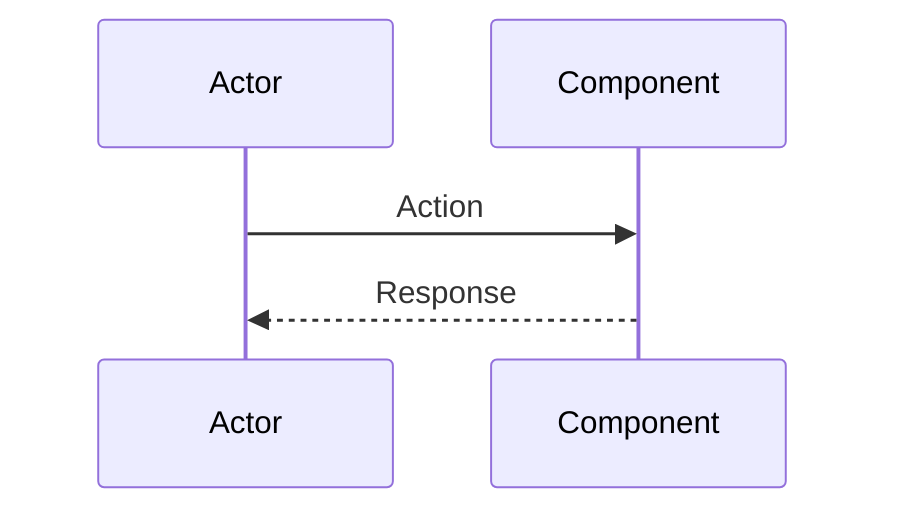
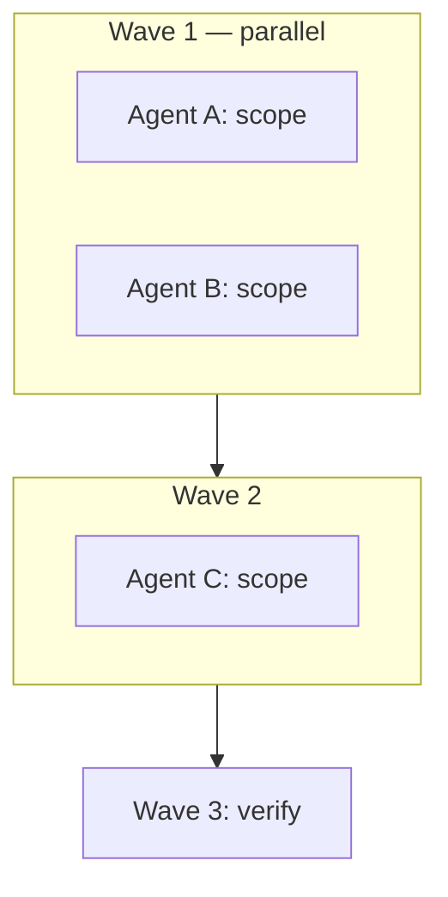

# <Plan title>

## Goals

- <!-- What success looks like -->
-

## No-goals

- <!-- Explicit out-of-scope / rejected approaches -->
-

## Validation

<!-- Why this approach; optional comparison table -->

| Option | Pros | Cons | Verdict |
|--------|------|------|---------|
| Chosen | | | Selected |
| Alternative A | | | Rejected |

## Target flow

```
1. <!-- Step -->
2. <!-- Step -->
3. <!-- Step -->
```



## Rejected

- <!-- Alternative + reason -->
-

## File change matrix

| Path | Action | Intent |
|------|--------|--------|
| `path/to/file.ts` | Create / Update / Delete | <!-- one line --> |

## Wave 0 — Contracts

Pass to all subagents:

| Rule | Detail |
|------|--------|
| <!-- contract name --> | <!-- detail --> |

## Execution — waves



### Wave 1

Dispatch in one message; `run_in_background: true` when multitask is enabled.

| Agent | Type | Files |
|-------|------|-------|
| A | cavecrew-builder / generalPurpose | `path/a.ts` |
| B | cavecrew-builder / generalPurpose | `path/b.ts` |

### Wave 2

| Agent | Type | Files |
|-------|------|-------|
| C | generalPurpose | `path/c.ts` |

### Wave 3

- Tests: `jest`, `tsc-verify`
- Manual checklist (below)
- Optional: `cavecrew-reviewer`

## Implementation detail

### Agent A — <title>

<!-- Files, snippets, constraints -->

### Agent B — <title>

<!-- Files, snippets, constraints -->

## Manual verification

1. <!-- Check -->
2. <!-- Check -->

## Out of scope

- <!-- Repeat critical no-goals -->
-
